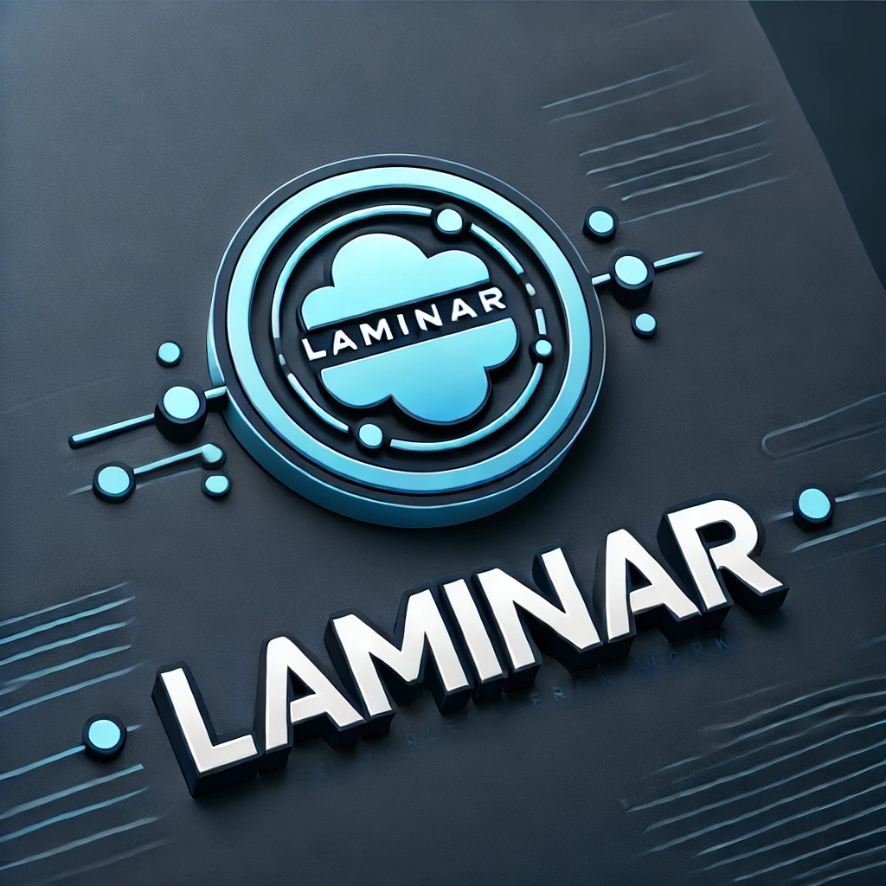

# Introduction

The Laminar Execution Engine is a crucial component of the Laminar framework, designed to execute dispel4py workflows. This is the only part of the system where [dispel4py](https://github.com/StreamingFlow/d4py), along with Redis, is installed and configured. The execution engine is built as a Flask application that handles and manages workflow execution requests from multiple users.

When a user submits a workflow execution request, the engine processes it through a queue system. This ensures that multiple workflows can be handled efficiently and concurrently. The engine supports various processing modes, including simple sequential execution, multiprocessing, and dynamic processing using Redis, making it flexible and scalable to meet different computational needs.

The engine communicates with the [Laminar Server](https://github.com/StreamingFlow/dispel4py-server) to retrieve and execute workflows on behalf of the [client](https://github.com/StreamingFlow/dispel4py-client), ensuring that all necessary resources are managed effectively. The results of an execution are directly sent back to the client.  Whether running locally or within a Docker container, the execution engine is responsible for the core computational tasks of the Laminar framework.

Laminar takes full advantage of dispel4py’s capabilities, including automatic parallelization of workflows and dynamic resource provisioning when running workflows in parallel or dynamically. These features ensure efficient and scalable execution of data-intensive applications.

# Laminar Execution Instructions

The following instructions will allow you to run the Flask application which executes dispel4py workflows 

# Docker
Clone repository 
```
git clone https://github.com/StreamingFlow/dispel4py-execution.git
```
Then enter directory by
```
cd dispel4py-execution 
```

Run docker compose to load up the execution engine and redis server. The first time we recommend to use --build flag.
```
docker compose up --build
```
Next time you could use:
```
docker compose up
```

If you need to rebuild the Docker containers (for instance, after making configuration changes), you can do so by following these steps:

First, bring down the running containers:
```
docker-compose down
```
Then, rebuild and start the containers:
```
docker-compose up --build
```
By following these steps, you can ensure that the execution engine is properly configured and running efficiently.


# Without Docker

Clone repository 
```
git clone https://github.com/Laminar-2/dispel4py-execution.git
```
Then enter directory by
```
cd dispel4py-execution 
```
In order to run the application you need to create a new Python 3.10 enviroment
```
--note conda must be installed beforehand, go to https://conda.io/projects/conda/en/stable/user-guide/install/linux.html
conda create --name py10 python=3.10
conda activate py10
```
Install app modules
```
pip install -r requirements_app.txt
```
Run application
```
python app.py
```

## Other Laminar components

The [laminar client](https://github.com/StreamingFlow/dispel4py-client) offers a user-friendly interface for registering and managing Processing Elements (PEs) as well as stream-based dispel4py workflows. For detailed guidance on how to interact with the system, please refer to the [user manual](https://github.com/StreamingFlow/dispel4py-client/wiki) available on the project's wiki.

In addition, [laminar server](https://github.com/StreamingFlow/dispel4py-server) is another essential component that must be installed and running, either locally or remotely. The server acts as the central hub for managing communication and coordination between the client and the execution engine. It also communicates with the registry, which stores, workflows, PEs, and other essential metadata.
